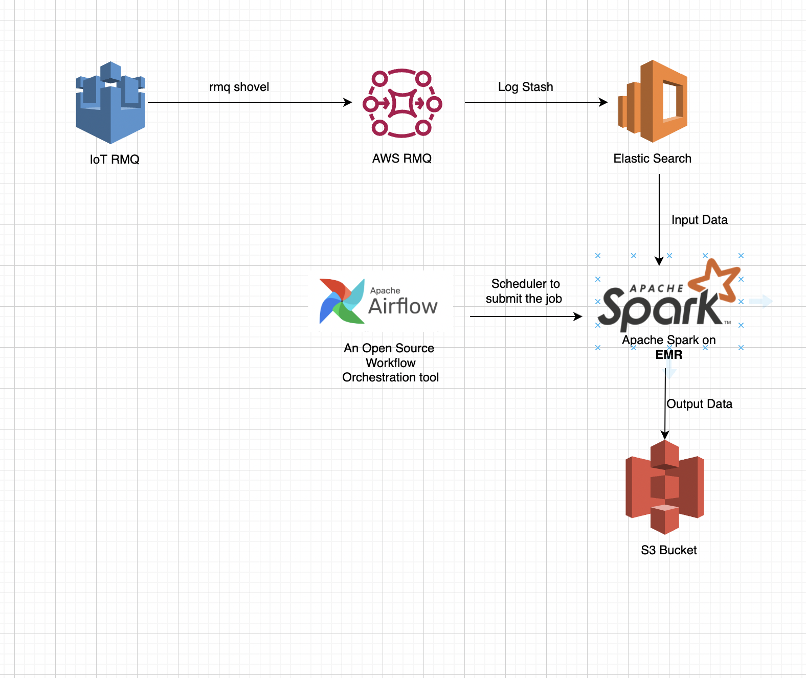

# There could be two solutions 

## Solution 1
========
### Architecture

### Description
-----------
1. As data is being pushed from IOT Rabbit MQ instance to AWS Rabbit MQ instance.
2. Then log stash is being used as a consumer and placing the data in elastic search.
3. There would be an EMR instance where spark jobs would be executed and jobs would be running
   as batch jobs.
4. These batch jobs could be excuted on daily basis, get the data form elastic search, process
   the data and then push the data on S3.
5. S3 is being used as a alternative data source of elastic search. while data is being stored 
   in the form of Partitioning by Timestamp. 
6. Apache ariflow is being used as orchestration tool to schedule and submit the spark job on EMR .
7. Now data science team can use the data from s3 to perform their tasks.

Note:

    This could be a costly solution.

## Solution 2
========
### Architecture

### Description
-----------
1. As data is being pushed from IOT Rabbit MQ instance to AWS Rabbit MQ instance.
2. Then log stash is being used as a consumer and placing the data in elastic search.
3. We can have an other AWS Rabbit MQ instance as shown in the architecture that would get data from IOT.
4. It will invoke Lmabda function that will get the data, process it and 
   push it on s3.
5. Now data science team can use the data from s3 to perform their tasks.

Note:

    Lambda concurrency issue could be faced if the frequency of messages in MQ is too high

    
## Important 
We have to implement S3 Lifecycle policy to archive the data when no longer be used by data sceince team.